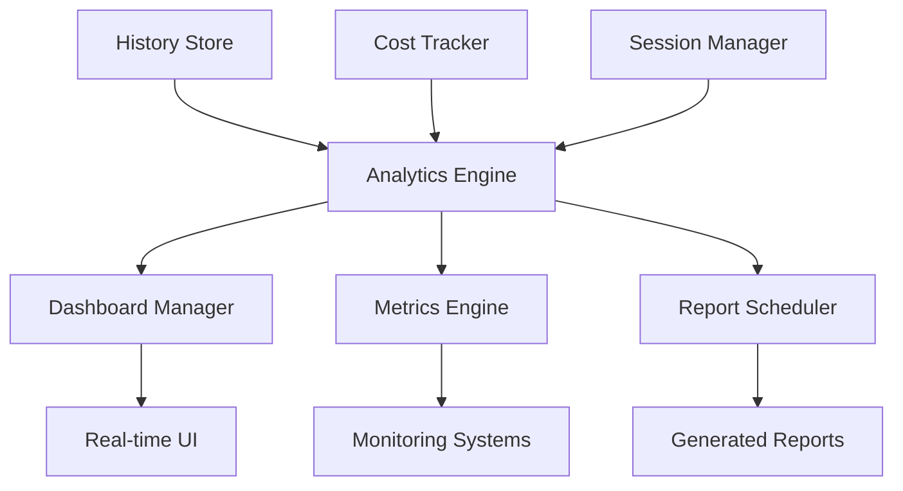

# Analytics Module

## Overview

The Analytics module provides comprehensive data analysis, reporting, and visualization capabilities for the Claude AI Interactive system. It integrates with the cost tracking and history modules to deliver real-time insights, automated reports, and interactive dashboards.

## Architecture

### Core Components

```
analytics/
├── mod.rs              # Main module with AnalyticsEngine
├── dashboard.rs        # Real-time dashboard functionality
├── metrics.rs          # Performance metrics collection
├── reports.rs          # Automated report generation
└── simple.rs           # Simplified analytics interface
```

### Key Types

- **`AnalyticsEngine`**: Central orchestrator for all analytics operations
- **`DashboardManager`**: Manages real-time dashboard views and updates
- **`MetricsEngine`**: Collects and aggregates performance metrics
- **`ReportScheduler`**: Handles automated report generation and delivery
- **`RealTimeAnalyticsStream`**: Provides streaming analytics updates

## Data Flow



## Usage Examples

### Basic Analytics Summary

```rust
use claude_ai_interactive::analytics::{AnalyticsEngine, AnalyticsConfig};

// Create analytics engine
let config = AnalyticsConfig::default();
let engine = AnalyticsEngine::new(
    cost_tracker.clone(),
    history_store.clone(),
    config
);

// Generate 30-day summary
let summary = engine.generate_summary(30).await?;

println!("Total cost: ${:.2}", summary.cost_summary.total_cost);
println!("Success rate: {:.1}%", summary.performance_metrics.success_rate);
```

### Real-time Dashboard

```rust
use claude_ai_interactive::analytics::DashboardManager;

// Create dashboard manager
let dashboard = DashboardManager::new(engine.clone());

// Start live updates
dashboard.start_live_updates().await?;

// Get current dashboard data
let data = dashboard.get_live_data().await?;

// Subscribe to updates
let mut updates = dashboard.subscribe_updates();
while let Some(update) = updates.recv().await {
    println!("Dashboard update: {:?}", update);
}
```

### Custom Metrics Collection

```rust
use claude_ai_interactive::analytics::{MetricsEngine, Counter, Gauge};

// Create metrics engine
let metrics = MetricsEngine::new(Default::default());

// Register custom metrics
metrics.register_counter(
    "api_calls",
    "Total API calls made",
    vec![("endpoint", "claude")]
).await?;

metrics.register_gauge(
    "active_sessions",
    "Number of active sessions",
    vec![]
).await?;

// Update metrics
metrics.increment_counter("api_calls", vec![("status", "success")]).await?;
metrics.set_gauge("active_sessions", 5.0).await?;
```

### Automated Reports

```rust
use claude_ai_interactive::analytics::{ReportScheduler, ReportTemplate, ReportFormat};

// Create report scheduler
let scheduler = ReportScheduler::new(engine.clone(), Default::default())?;

// Schedule weekly cost report
let template = ReportTemplate::cost_summary()
    .with_sections(vec!["summary", "by_model", "by_command"])
    .with_insights(true);

scheduler.schedule_report(
    "weekly_cost_report",
    ReportSchedule::Weekly { 
        weekday: Weekday::Mon, 
        hour: 9 
    },
    template,
    ReportFormat::Html,
    vec!["admin@example.com"]
).await?;

// Generate immediate report
let report = scheduler.generate_report("weekly_cost_report").await?;
```

## Performance Considerations

### Memory Management

The analytics module implements several optimizations:

1. **Streaming Processing**: Large datasets are processed in chunks
2. **Bounded Buffers**: Real-time update buffers have size limits
3. **Lazy Loading**: Historical data is loaded on-demand
4. **Caching**: Frequently accessed metrics are cached

### Scalability

- **Metric Aggregation**: Pre-computed aggregates for common queries
- **Time-based Partitioning**: Data organized by time periods
- **Async Operations**: All I/O operations are non-blocking
- **Batch Processing**: Updates processed in batches for efficiency

### Example: High-Performance Streaming

```rust
use claude_ai_interactive::analytics::RealTimeAnalyticsStream;

// Create streaming analytics
let stream = RealTimeAnalyticsStream::new(engine.clone()).await?;

// Process updates in batches
stream.start_streaming().await?;

// Handle high-volume updates efficiently
let updates = stream.get_recent_updates(100).await;
stream.process_update_batch(updates).await?;

// Monitor memory usage
let memory_stats = stream.memory_tracker.get_stats();
println!("Peak memory: {}MB", memory_stats.peak_memory_mb);
```

## Configuration

### Analytics Configuration

```rust
use claude_ai_interactive::analytics::AnalyticsConfig;

let config = AnalyticsConfig {
    enable_real_time_alerts: true,
    cost_alert_threshold: 50.0,  // Alert when daily cost exceeds $50
    report_schedule: ReportSchedule::Daily,
    retention_days: 90,
    dashboard_refresh_interval: 30,  // seconds
};
```

### Dashboard Configuration

```rust
use claude_ai_interactive::analytics::DashboardConfig;

let dashboard_config = DashboardConfig {
    refresh_interval_seconds: 30,
    max_recent_entries: 50,
    enable_live_updates: true,
    chart_time_range_hours: 24,
};
```

### Metrics Configuration

```rust
use claude_ai_interactive::analytics::MetricConfig;

let metric_config = MetricConfig {
    collection_interval_seconds: 10,
    retention_duration_hours: 168,  // 1 week
    enable_high_cardinality_metrics: false,
    metric_buffer_size: 10000,
};
```

## Alert System

The analytics module includes a comprehensive alerting system:

### Alert Types

- **Cost Threshold**: Triggered when spending exceeds limits
- **Error Rate**: High failure rates detected
- **Performance Degradation**: Slow response times
- **Unusual Usage**: Anomalous patterns detected
- **System Health**: Infrastructure issues

### Example: Alert Configuration

```rust
use claude_ai_interactive::analytics::{Alert, AlertType, AlertSeverity};

// Check for alerts
let alerts = engine.get_active_alerts().await?;

for alert in alerts {
    match alert.severity {
        AlertSeverity::Critical => {
            // Send immediate notification
            notify_admin(&alert).await?;
        }
        AlertSeverity::High => {
            // Log and queue for review
            log::error!("High severity alert: {}", alert.message);
        }
        _ => {
            // Standard logging
            log::warn!("Alert: {}", alert.message);
        }
    }
}
```

## Integration with Other Modules

### Cost Tracker Integration

```rust
// Analytics automatically integrates with cost data
let cost_insights = engine.generate_cost_insights(
    session_id,
    TimeRange::LastWeek
).await?;
```

### History Store Integration

```rust
// Analyze command patterns
let command_analytics = engine.analyze_command_patterns(
    HistorySearch::new()
        .with_time_range(TimeRange::LastMonth)
        .with_success_only(true)
).await?;
```

### Session Manager Integration

```rust
// Per-session analytics
let session_report = engine.generate_session_report(session_id).await?;
```

## Error Handling

The analytics module provides comprehensive error handling:

```rust
use claude_ai_interactive::analytics::AnalyticsError;

match engine.generate_summary(30).await {
    Ok(summary) => process_summary(summary),
    Err(AnalyticsError::DataNotAvailable) => {
        log::warn!("No data available for analysis");
    }
    Err(AnalyticsError::CalculationError(msg)) => {
        log::error!("Calculation failed: {}", msg);
    }
    Err(e) => {
        log::error!("Analytics error: {:?}", e);
    }
}
```

## Testing

The module includes comprehensive test coverage:

```bash
# Run all analytics tests
cargo test -p claude-sdk-rs-interactive analytics

# Run specific test suites
cargo test -p claude-sdk-rs-interactive analytics::dashboard_tests
cargo test -p claude-sdk-rs-interactive analytics::metrics_tests
cargo test -p claude-sdk-rs-interactive analytics::report_tests

# Run property-based tests
cargo test -p claude-sdk-rs-interactive analytics::property_tests
```

## Future Enhancements

### Planned Features

1. **Machine Learning Integration**: Predictive cost modeling
2. **Advanced Visualizations**: Interactive charts and graphs
3. **Custom Dashboards**: User-defined dashboard layouts
4. **Export Integrations**: Direct export to monitoring platforms
5. **Anomaly Detection**: Automatic pattern recognition

### Extension Points

The analytics module is designed for extensibility:

- Custom metric types via the `Metric` trait
- Plugin system for report formats
- Webhook support for alerts
- Custom aggregation functions

## Troubleshooting

### Common Issues

1. **High Memory Usage**
   - Reduce `metric_buffer_size`
   - Decrease `retention_duration_hours`
   - Enable data archiving

2. **Slow Dashboard Updates**
   - Increase `refresh_interval_seconds`
   - Enable metric caching
   - Use time-based aggregations

3. **Missing Data**
   - Verify cost tracker is recording
   - Check history store persistence
   - Ensure proper permissions

### Debug Mode

Enable detailed logging:

```rust
env_logger::init_from_env(
    env_logger::Env::new().default_filter_or("claude_ai_interactive::analytics=debug")
);
```

## License

This module is part of the Claude AI Interactive project and follows the same license terms.